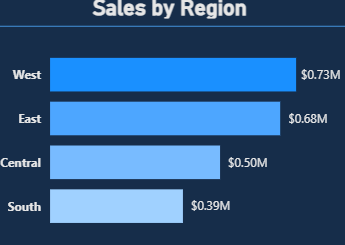
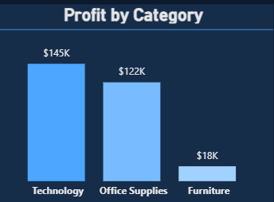

# 🛒 Superstore Sales Dashboard — Power BI

This Power BI dashboard provides a comprehensive analysis of Superstore sales, profit trends, regional performance, and product insights.  
The project demonstrates **data modeling, DAX calculations, interactive visuals, and business-focused KPI storytelling**.

---

## 📊 Dashboard Overview


The dashboard includes:

- **Total Sales:** $2.30M  
- **Total Profit:** $286.41K  
- **Total Orders:** 5009  
- **Average Discount:** 15.62%  
- **Profit Margin %:** 12.47%

Interactive slicers:  
`Order Year | Segment | State | Ship Mode`

---

## 📈 Key Visuals

### 🔹 Sales by Region


### 🔹 Monthly Sales & Profit Trend


### 🔹 Profit by Category


### 🔹 Top 10 Products by Sales


### 🔹 Top Subcategories


---

## 🧮 Key DAX Measures

### **📌 Profit Margin %**
```DAX
Profit Margin % =
DIVIDE(
    SUM ( 'Sample - Super Store'[Profit] ),
    SUM ( 'Sample - Super Store'[Sales] )
)
```

### **📌 Sales % of Total**
```DAX
Sales % of Total =
DIVIDE(
    SUM ( 'Sample - Super Store'[Sales] ),
    CALCULATE(
        SUM ( 'Sample - Super Store'[Sales] ),
        ALL ( 'Sample - Super Store' )
    )
)
```

## 🛠 Tools Used

- Power BI Desktop
- Power Query (data cleaning & transformation)
- DAX (calculated measures)
- Data modeling (star schema)


## 📂 Project Structure
```DAX
Superstore-sales-dashboard/
│
├── Excel               
├── screenshots/         
├── Sales Dashboard - Super Store PBIX    
└── README.md
```

## ⭐ Insights Delivered

- West region generates the highest sales ($0.73M).
- Technology category leads profit with $145K.
- Sales gradually decline through the year but show stability
- Chairs and Binders top the subcategory contributions.
